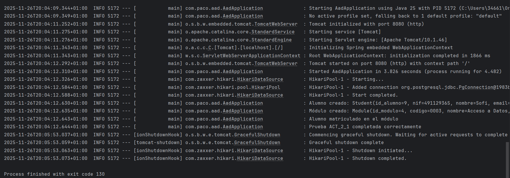

# ACT 2_1 – Sistema de Gestión de Matrículas (Spring Boot + JDBC + PostgreSQL)

## 1. Descripción General

Esta práctica consiste en implementar un sistema básico de **gestión de matrículas** utilizando:

- **Spring Boot 3**
- **JdbcTemplate (JDBC puro con SQL)**
- **PostgreSQL 15** desplegado con **Docker**
- **Transacciones gestionadas por Spring**
- Repositorios simples implementados a mano (sin JPA ni Hibernate)

El sistema permite:

- Crear alumnos
- Crear módulos
- Matricular alumnos en módulos
- Eliminar alumnos
- Persistir todos los datos en PostgreSQL

Todo el proceso se valida mediante la ejecución del método `run()` de `AadApplication`, que realiza una prueba
automatizada de inserciones, matriculación y eliminación.

## 2. Instrucciones de Ejecución

### 2.1. Levantar PostgreSQL con Docker

En la raíz del proyecto debe existir un archivo **docker-compose.yml** como este:

```yaml
services:
  postgres:
    image: postgres:15
    container_name: aad_postgres
    environment:
      POSTGRES_DB: aad_db
      POSTGRES_USER: postgres
      POSTGRES_PASSWORD: 1234
    ports:
      - "5434:5432"
```

Para levantar el contenedor de PostgreSQL, ejecutar en la terminal:

```
docker-compose up -d
``` 

Esto iniciará un contenedor con PostgreSQL accesible en el puerto `5434` de tu máquina local.

### 2.2. Configurar la Conexión a la Base de Datos

En el archivo `application.yml`, configurar la conexión a PostgreSQL:

```properties
spring:
datasource:
url:jdbc:postgresql://localhost:5434/aad_db
username:postgres
password:1234
driver-class-name:org.postgresql.Driver

```

### 2.3. Crear las Tablas (Script SQL)

Antes de ejecutar la aplicación, es necesario crear las tablas en la base de datos. Utiliza el siguiente script SQL:

- 01_schema.sql

```sql
CREATE TABLE IF NOT EXISTS alumno (
    id SERIAL PRIMARY KEY,
    nif VARCHAR(20) NOT NULL,
    nombre VARCHAR(100) NOT NULL,
    email VARCHAR(100) NOT NULL
);

CREATE TABLE IF NOT EXISTS modulo (
    id SERIAL PRIMARY KEY,
    codigo VARCHAR(20) NOT NULL,
    nombre VARCHAR(100) NOT NULL,
    horas INT NOT NULL
);

CREATE TABLE IF NOT EXISTS matricula (
    id SERIAL PRIMARY KEY,
    id_alumno INT REFERENCES alumno(id),
    id_modulo INT REFERENCES modulo(id),
    fecha DATE NOT NULL
);
```

- 02_procedures.sql

```sql
CREATE OR REPLACE FUNCTION count_enrollments(student_id INT)
RETURNS INT AS $$
DECLARE total INT;
BEGIN
    SELECT COUNT(*) INTO total
    FROM matricula
    WHERE id_alumno = student_id;
    RETURN total;
END;
$$ LANGUAGE plpgsql;
```

### 2.4. Ejecutar la Aplicación

Finalmente, ejecutar la aplicación Spring Boot. El método `run()` de `AadApplication` realizará una prueba
automatizada de las funcionalidades implementadas.

## 3. Evidencias de ejecución

A continuación se muestran fragmentos de consola que demuestran el correcto funcionamiento del sistema según los
requisitos de la práctica.

### 3.1. Inicialización correcta de la base de datos

Al iniciar Spring Boot, los scripts `01_schema.sql` y `02_procedures.sql` se ejecutan correctamente:

```sql
INFO --- HikariPool-1 - Starting...
INFO --- HikariPool-1 - Start completed.
INFO --- Executing SQL script: class path resource [sql/01_schema.sql]
INFO --- Executing SQL script: class path resource [sql/02_procedures.sql]
  INFO --- Base de datos inicializada correctamente
```

### 3.2. Creación de estudiantes y módulos

El método `run()` ejecuta las inserciones mediante `JdbcTemplate`:

```yml
INFO --- Alumno creado: Student(id=5, nif='49112936R', nombre='Sofi', email='Sofi@gmail.com
  ')
INFO --- Módulo creado: Module(id=4, codigo='0001', nombre='Programación', horas=250)
```

### 3.3. Inserción de matrículas dentro de la transacción

La matrícula se crea correctamente en la tabla `matricula`:

```yml
INFO --- Matrícula insertada: Enrollment(id=7, id_alumno=5, id_modulo=4, fecha=2025-11-26)
```

### 3.4. Invocación correcta de la función almacenada `count_enrollments`

La función definida en `02_procedures.sql` funciona correctamente:

```sql
SELECT count_enrollments(5);
count_enrollments
```

### 3.5. Persistencia de los datos en PostgreSQL tras la ejecución

Después de ejecutar el método `run()`, pueden observarse los datos persistidos en la base de datos:

#### Tabla alumno:

```yml
SELECT * FROM alumno;
id | nif | nombre | email
----+------------+--------+-----------------
5 | 49112936R | Sofi | Sofi@gmail.com
```

#### Tabla modulo:

```yml
SELECT * FROM modulo;
id | codigo | nombre | horas
----+--------+---------------+-------
4 | 0001 | Programación | 250
```

#### Tabla matricula:

```yml
SELECT * FROM matricula;
id | id_alumno | id_modulo | fecha
----+-----------+-----------+------------
7 | 5 | 4 | 2025-11-26
```

Estas evidencias confirman que:

- La base de datos se inicializa correctamente.
- Las inserciones funcionan.
- Las matrículas se insertan en transacción.
- La función almacenada es invocada correctamente.
- Los datos quedan persistidos en PostgreSQL.

A continuación, se muestra una captura de pantalla con la ultima ejecución del programa:

y ya que no cabe toda la consola, aquí está el archivo completo de la última ejecución:

```yml
2025-11-26T20:04:09.344+01:00  INFO 5172 --- [           main] com.paco.aad.AadApplication: Starting AadApplication using Java 25 with PID 5172 (C:\Users\34661\OneDrive\Escritorio\Grado Superior Segundo Curso\ACCESO A DATOS\AAD_25_26\target\classes started by 34661 in C:\Users\34661\OneDrive\Escritorio\Grado Superior Segundo Curso\ACCESO A DATOS\AAD_25_26)
2025-11-26T20:04:09.349+01:00  INFO 5172 --- [           main] com.paco.aad.AadApplication:
  No active profile set, falling back to 1 default profile: "default"
2025-11-26T20:04:11.252+01:00  INFO 5172 --- [           main] o.s.b.w.embedded.tomcat.TomcatWebServer: Tomcat initialized with port 8080 (http)
2025-11-26T20:04:11.275+01:00  INFO 5172 --- [           main] o.apache.catalina.core.StandardService: Starting service [Tomcat]
2025-11-26T20:04:11.276+01:00  INFO 5172 --- [           main] o.apache.catalina.core.StandardEngine:
  Starting Servlet engine: [ Apache Tomcat/10.1.46 ]
2025-11-26T20:04:11.343+01:00  INFO 5172 --- [           main] o.a.c.c.C.[Tomcat].[localhost].[/]: Initializing Spring embedded WebApplicationContext
2025-11-26T20:04:11.343+01:00  INFO 5172 --- [           main] w.s.c.ServletWebServerApplicationContext:
  Root WebApplicationContext: initialization completed in 1866 ms
2025-11-26T20:04:12.292+01:00  INFO 5172 --- [           main] o.s.b.w.embedded.tomcat.TomcatWebServer: Tomcat started on port 8080 (http) with context path '/'
2025-11-26T20:04:12.310+01:00  INFO 5172 --- [           main] com.paco.aad.AadApplication: Started AadApplication in 3.826 seconds (process running for 4.482)
2025-11-26T20:04:12.326+01:00  INFO 5172 --- [           main] com.zaxxer.hikari.HikariDataSource: HikariPool-1 - Starting...
2025-11-26T20:04:12.584+01:00  INFO 5172 --- [           main] com.zaxxer.hikari.pool.HikariPool: HikariPool-1 - Added connection org.postgresql.jdbc.PgConnection@1983b48a
2025-11-26T20:04:12.588+01:00  INFO 5172 --- [           main] com.zaxxer.hikari.HikariDataSource: HikariPool-1 - Start completed.
2025-11-26T20:04:12.630+01:00  INFO 5172 --- [           main] com.paco.aad.AadApplication:
  Alumno creado: Student(id_alumno=9, nif=49112936S, nombre=Sofi, email=sofia@gmail.com)
2025-11-26T20:04:12.635+01:00  INFO 5172 --- [           main] com.paco.aad.AadApplication:
  Módulo creado: Module(id_modulo=4, codigo=0003, nombre=Acceso a Datos, horas=250)
2025-11-26T20:04:12.643+01:00  INFO 5172 --- [           main] com.paco.aad.AadApplication: Alumno matriculado en el módulo
2025-11-26T20:04:12.644+01:00  INFO 5172 --- [           main] com.paco.aad.AadApplication: Prueba ACT_2_1 completada correctamente
2025-11-26T20:05:53.037+01:00  INFO 5172 --- [ionShutdownHook] o.s.b.w.e.tomcat.GracefulShutdown: Commencing graceful shutdown. Waiting for active requests to complete
2025-11-26T20:05:53.059+01:00  INFO 5172 --- [tomcat-shutdown] o.s.b.w.e.tomcat.GracefulShutdown: Graceful shutdown complete
2025-11-26T20:05:53.063+01:00  INFO 5172 --- [ionShutdownHook] com.zaxxer.hikari.HikariDataSource: HikariPool-1 - Shutdown initiated...
2025-11-26T20:05:53.073+01:00  INFO 5172 --- [ionShutdownHook] com.zaxxer.hikari.HikariDataSource: HikariPool-1 - Shutdown completed.
```

## 4. Conclusión personal

Aparte de ser una actividad a la vista en clase, creo que me ha venido bastante bien para entender mejor el contenido
visto y puesto a prueba en clase:

- La configuración de Spring Boot con PostgreSQL.
- La creación de tablas y funciones almacenadas en PostgreSQL.
- El uso de JdbcTemplate para realizar operaciones CRUD.
- La gestión de transacciones con Spring.

Aunque es algo tediosa de hacer, me ha parecido una práctica muy útil para afianzar los conocimientos.

